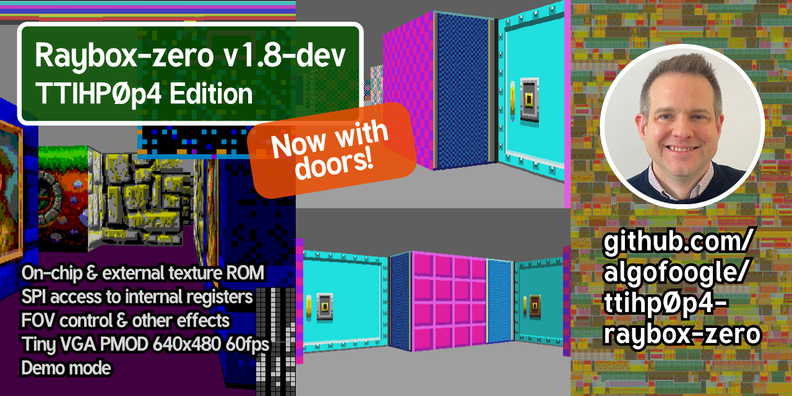

## How it works

This is an experimental GF180 (gf180mcuD Open PDK) updated submission of [ttcad25a-raybox-zero](https://github.com/algofoogle/ttcad25a-raybox-zero) (an updated version of [tt07-raybox-zero](https://github.com/algofoogle/tt07-raybox-zero), from the [raybox-zero](https://github.com/algofoogle/raybox-zero) project).

This project is a framebuffer-less VGA display generator (i.e. it is 'racing the beam') that produces a simple implementation of a "3D"-like ray casting game engine... just the graphics part of it. It is inspired by Wolfenstein 3D, using a map that is a grid of wall blocks, with basic texture mapping.

This version features textured walls (internally-generated or from off-chip QSPI memory), optional doors (sliding panels), flat-coloured floor and ceiling, and a variety of other rendering "hacks" for other simple visual effects. No sprites yet, sorry. Maybe that will come in a future version.

The 'player' POV ("point of view") registers allow the player position, facing X/Y vector, and viewplane X/Y vector in one go, and (along with other visual effects registers) are controlled by a single SPI interface.

NOTE: To optimise the design and make it work without a framebuffer, this renders what is effectively a portrait view, rotated. A portrait monitor (i.e. one rotated 90 degrees anti-clockwise) will display this like the conventional first-person shooter view, but it could still be used in a conventional landscape orientation if you imagine it is for a game where you have a first-person perspective of a flat 2D platformer, endless runner, "Descent-style" game, whatever.

TBC. Please contact me if you want to know something in particular and I'll put it into the documentation!

## How to test

TBC. Please contact me if you want to know something in particular and I'll put it into the documentation!

Supply a clock in the range of 21-31.5MHz; 25.175MHz is ideal because this is meant to be "standard" VGA 640x480@59.94Hz, and note that the design may not be stable above that.

Start with `gen_texb` set low, to use internally-generated textures. You can optionally attach an external QSPI memory (`tex_...`) for texture data instead, and then set `gen_texb` high to use it.

`tex_pmod_type` should be set to 0 when using Leo Moser's Tiny QSPI PMOD, or 1 for a Digilent QSPI PMOD. 

Ideally the `reg` input should be high to make the VGA outputs registered. Otherwise, they are just as they come out of internal combo logic, which may not always meet timing (and hence might be unstable). I've done it this way so I can test the difference (if any).

`debug` can be asserted to show current state of POV (point-of-view) registers, which might come in handy when trying to debug SPI writes.

`inc_px` and `inc_py` can be set high to continuously increment their respective player X/Y position register. Normally the registers should be updated via SPI, but this allows someone to at least see a demo in action without having to implement the SPI host controller. NOTE: Using either of these will suspend POV updates via SPI.

Unlike the TT07 version, this one combines the two separate SPI peripheral interfaces into one, allowing both the POV and other registers to be updated from the same interface.

## External hardware

Tiny VGA PMOD on dedicated outputs (`uo`).

Optional SPI controllers to drive `ui_in[2:0]`.

Optional external SPI ROM for textures.

TBC. Please contact me if you want to know something in particular and I'll put it into the documentation!
